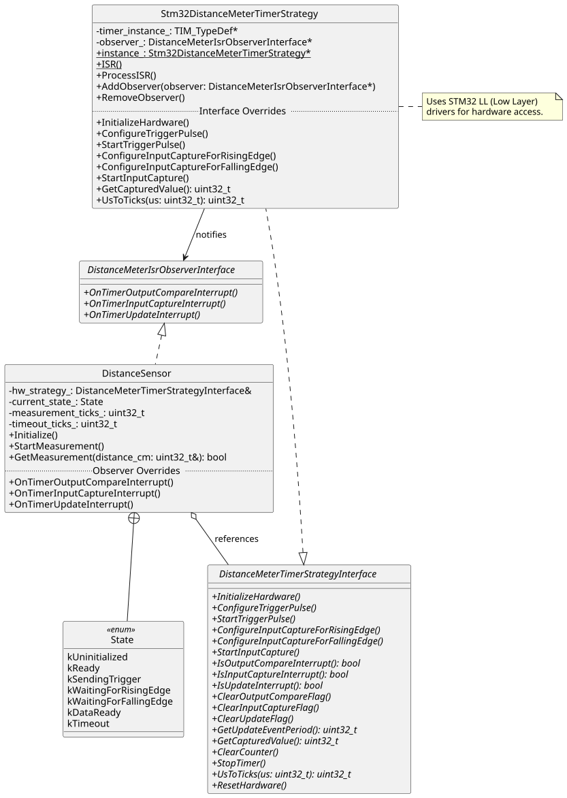
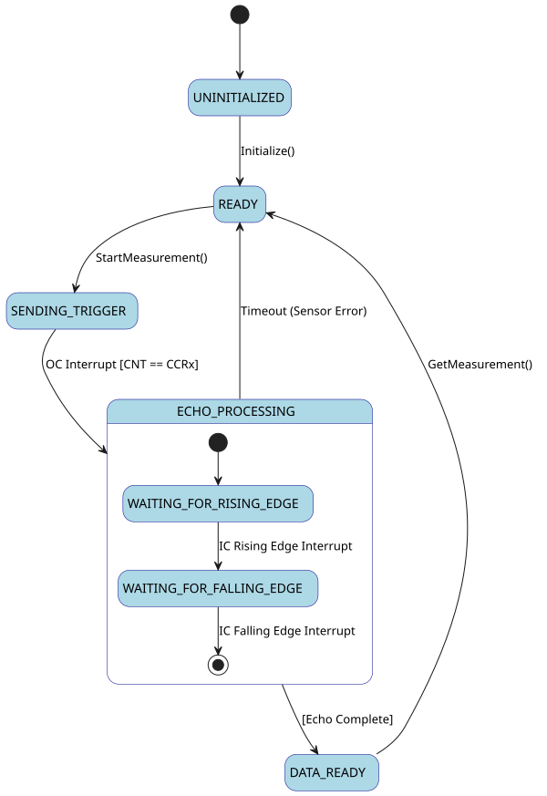

# Architecture-Independent HC-SR04 C++ Driver

This repository provides a high-level, platform-agnostic C++ driver for the **HC-SR04 Ultrasonic Distance Sensor**. Designed with modern embedded software engineering principles, it ensures zero hardware coupling and high testability across different microcontroller architectures.


## 🛠 Architectural Overview

The driver utilizes a decoupled architecture to separate high-level sensor logic from low-level hardware peripherals such as Timers and Input Capture units.

### Key Design Patterns:
* **Strategy Pattern:** Hardware-specific operations (Timer configuration, Pulse generation) are abstracted via the `DistanceMeterTimerStrategyInterface`.
* **Observer Pattern:** The `DistanceSensor` acts as an observer of hardware events (Rising/Falling edges, Timer overflows) through the `DistanceMeterIsrObserverInterface`.
* **Finite State Machine (FSM):** The measurement cycle is managed by a robust internal state machine to handle asynchronous timing, echo detection, and timeouts safely.


## 🧩 Class Structure

| Class/Interface | Responsibility |
| :--- | :--- |
| `DistanceSensor` | Main logic, State Machine management, and Distance calculation. |
| `DistanceMeterTimerStrategyInterface` | Abstract interface for Hardware Abstraction (HAL/LL). |
| `Stm32DistanceMeterTimerStrategy` | Concrete implementation for STM32 using LL (Low-Layer) drivers. |
| `DistanceMeterIsrObserverInterface` | Interface for receiving interrupt-driven events from hardware. |

### Class Diagram



### State Diagram



## 🚀 Getting Started

### 1. Implement the Strategy
To port this driver to a new architecture (e.g., AVR, ESP32, or a different STM32 family), simply implement the `DistanceMeterTimerStrategyInterface`.

### 2. Basic Usage (STM32 Example)
```cpp
// 1. Create hardware strategy (e.g., using TIM2 on STM32)
Stm32DistanceMeterTimerStrategy timerHw(TIM2);

// 2. Inject strategy into the sensor driver
DistanceSensor hc_sr04(timerHw);

// 3. Connect the observer (ISR notification bridge)
timerHw.AddObserver(&hc_sr04);

// 4. Initialize and Start Measurement
hc_sr04.Initialize();
hc_sr04.StartMeasurement();

// 5. Retrieve measurement
uint32_t distance_cm = 0;
if (hc_sr04.GetMeasurement(distance_cm)) {
    // Successfully measured distance_cm
}
```

## 🧪 Key Advantages

* **Platform Agnostic:** Runs on any MCU by swapping the Strategy implementation.
* **Unit Testable:** The `DistanceSensor` logic can be tested on a host PC by providing a Mock Strategy.
* **Non-Blocking:** Leverages Interrupts and Input Capture for precise timing without halting CPU execution.

## 📋 Requirements

* C++11 or higher.
* ARM GCC or any standard embedded C++ compiler.
* Hardware Timer with Input Capture and Output Compare support.
